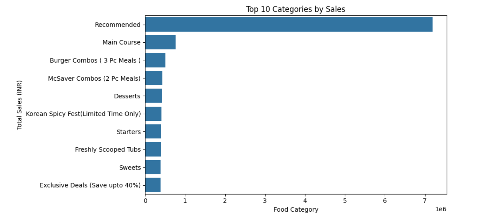
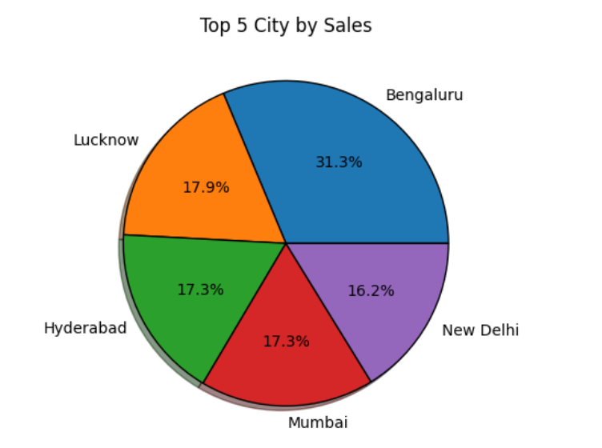
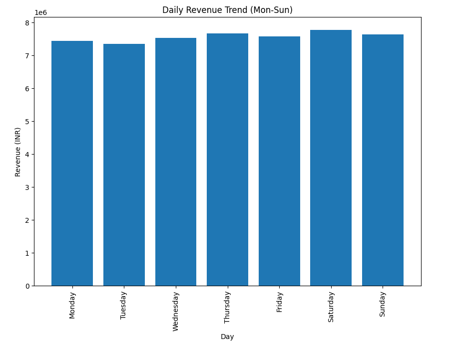
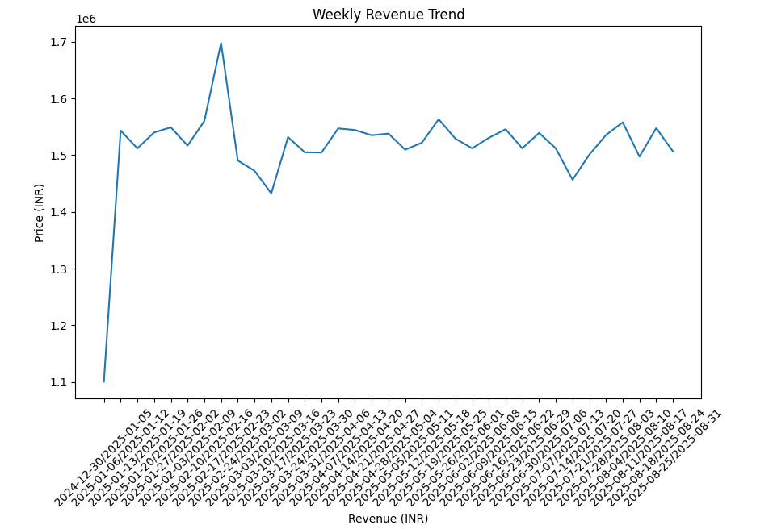
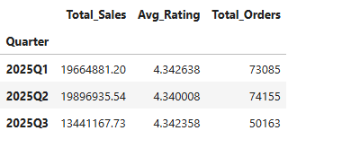

Swiggy Sales Analysis

📌 Project Overview

This project analyzes Swiggy sales data using Python and data analysis libraries to uncover valuable business insights. The analysis focuses on sales performance across cities, states, categories, and different time periods to identify trends and customer behavior patterns.

The project demonstrates practical applications of data cleaning, exploratory data analysis (EDA), aggregation techniques, and data visualization using Pandas, Matplotlib, and Seaborn.

---

🎯 Objectives

- Analyze overall sales performance.
- Identify top-performing cities and states.
- Explore sales distribution across food categories.
- Analyze daily, weekly, and quarterly sales trends.
- Generate actionable business insights from the data.

---

🛠️ Tools & Technologies

- Python
- Pandas
- NumPy
- Matplotlib
- Seaborn
- Jupyter Notebook

---

📊 Analysis Performed

1. Data Exploration

- Dataset overview
- Shape and column inspection
- Data type analysis
- Summary statistics

2. Data Cleaning

- Missing value detection
- Duplicate value checking
- Date conversion and formatting

3. State-wise Sales Analysis

- Total revenue generated by each state
- Identification of top-performing states

4. Sales by Category

- Revenue contribution by food category
- Comparison of category performance

5. Top 5 Cities by Sales

- Identification of highest revenue-generating cities
- Sales contribution analysis using visualization

6. Daily Sales Trend Analysis

- Daily revenue tracking
- Identification of sales fluctuations and patterns

7. Weekly Sales Trend Analysis

- Weekly revenue aggregation
- Trend analysis over time

8. Quarterly Performance Analysis

- Total Sales
- Average Customer Rating
- Total Orders
- Quarterly business performance evaluation

---

📈 Key Insights

- Bengaluru emerged as the highest revenue-generating city.
- Major metropolitan cities contributed a significant portion of total sales.
- Certain food categories consistently outperformed others in revenue generation.
- Daily sales trends revealed noticeable fluctuations in customer demand.
- Weekly analysis highlighted variations in revenue performance across different weeks.
- Quarterly analysis showed changes in sales performance over time.
- Customer ratings remained relatively stable, indicating consistent customer satisfaction.
- State-wise analysis identified key regions driving overall business growth.

---

📌 Conclusion

The Swiggy Sales Analysis project provides a comprehensive overview of sales performance across multiple dimensions, including geography, category, and time. The analysis highlights top-performing cities and states, reveals customer preferences across categories, and uncovers important daily, weekly, and quarterly trends. These insights can support data-driven decision-making, targeted marketing strategies, and future business growth initiatives.

---

📂 Project Structure

swiggy Sales Analysis/
│
├── Swiggy Sales Analysis.ipynb
├── swiggy_data.csv
├── README.md
├── requirements.txt
└── images/

## 📷 Sample Visualizations

### Sales by Category

### Top 5 Cities by Sales

### Daily Sales Trend

### Weekly Sales Trend

### Quarterly Performance Analysis

---

👨‍💻 Author

Kousik Chakraborty

Aspiring Data Analyst | Python | Pandas | Data Visualization
